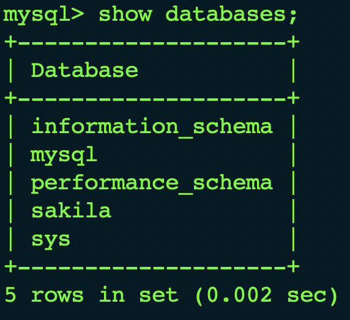
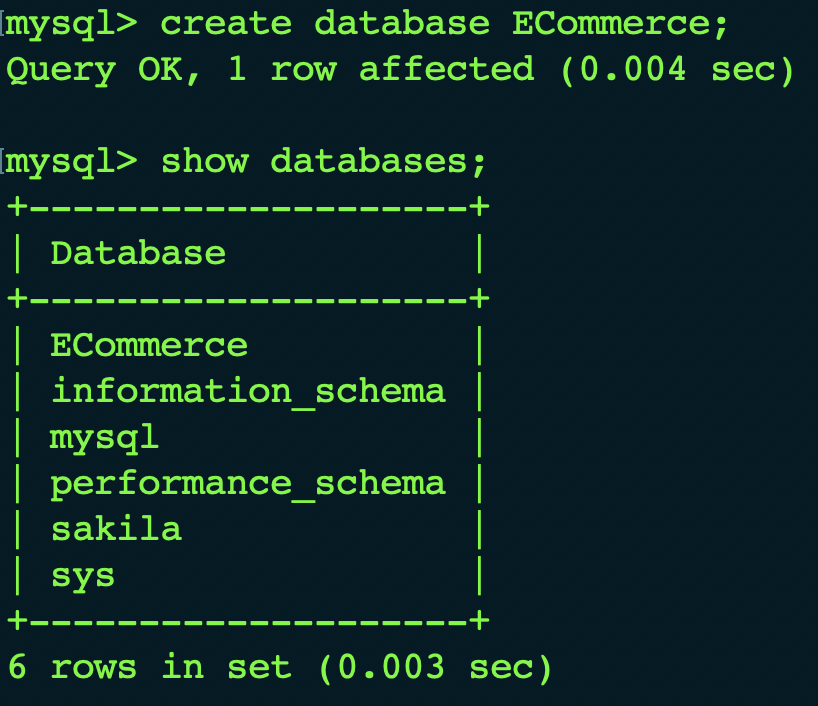
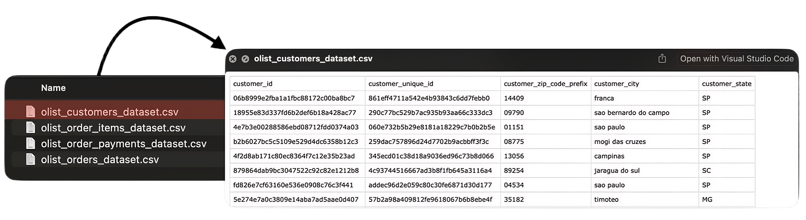
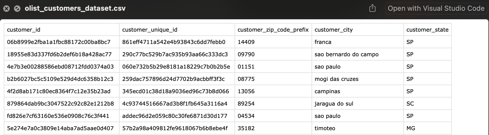
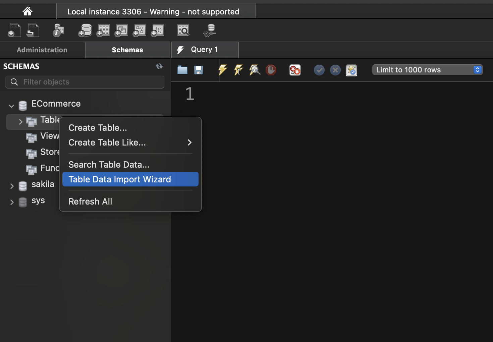
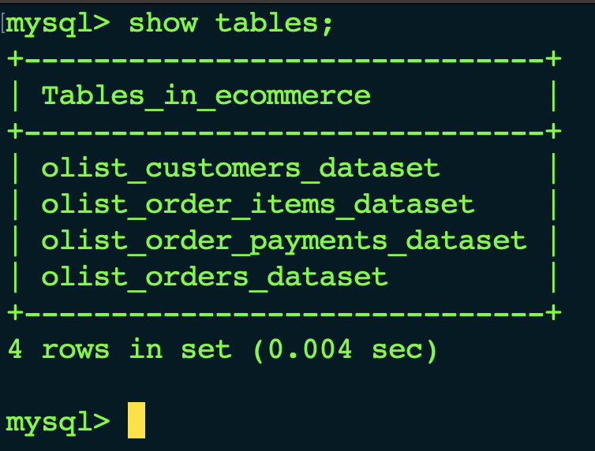
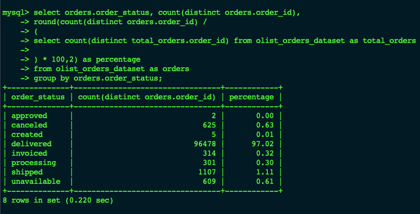
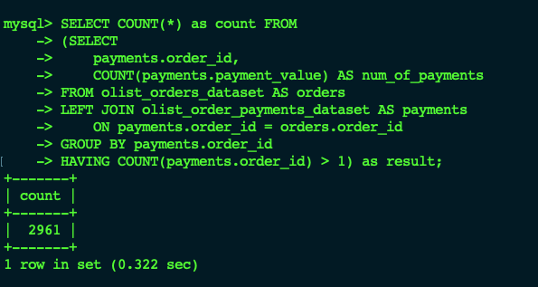
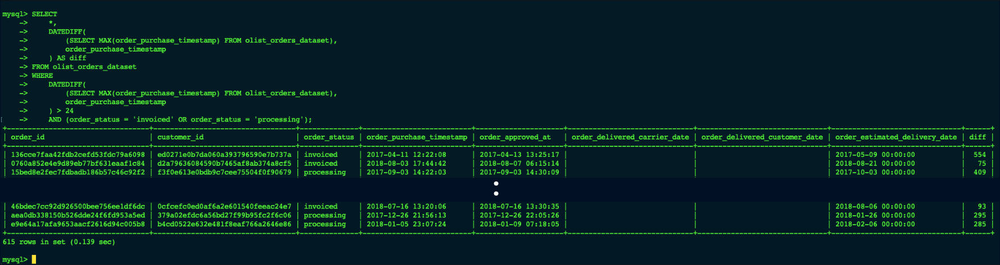

# SQL Support Investigation Lab

An application support investigation against the Olist Brazilian E-Commerce public dataset, worked the way a real payment and order reconciliation ticket would actually be handled: starting from a vague complaint, building a baseline before assuming anything, narrowing down to the specific affected records, and reporting what the data actually showed, including a couple of places where the first approach turned out to be measuring the wrong thing.

---

## The Ticket

Ticket #INC2031 came in two ways at once. Finance flagged a discrepancy during their weekly reconciliation between total payments recorded and the total value of orders actually confirmed as delivered or shipped. Separately, a handful of customers had contacted support directly, asking why their order still showed as "processing" or "invoiced" days after they'd already received a payment confirmation. Support was asked to scope the issue and report findings before escalating to engineering.

Going in, there was no assumption about what the answer would be. It could have turned out to be a real systemic fault, a specific payment method failing to trigger status updates, or just normal processing variance that happened to catch finance's eye that week. The investigation below was built to find out which, and report whichever one was actually true.

---

## Environment

Investigated using MySQL 8.0 against the [Olist Brazilian E-Commerce Public Dataset](https://www.kaggle.com/datasets/olistbr/brazilian-ecommerce) (Kaggle), a real dataset of roughly 100,000 orders, not a synthetic teaching schema. The two tables in scope were `olist_orders_dataset`, which carries a genuine `order_status` field (`delivered`, `shipped`, `processing`, `invoiced`, `canceled`, `unavailable`, `approved`, `created`), and `olist_order_payments_dataset`, which carries real payment values and installment data. Nothing was artificially seeded, whatever this investigation found is whatever was actually in the data.

All investigative queries were run from the MySQL CLI rather than a GUI, to mirror working against a production system without GUI access. MySQL Workbench was used once, earlier, purely to import the source CSVs.

### Setting Up

**Starting from a clean instance.** Before creating anything, confirmed no e-commerce database existed yet.

```sql
SHOW DATABASES;
```



**Creating the database.**

```sql
CREATE DATABASE ecommerce;
SHOW DATABASES;
```



**Reviewing the source data before touching it.** Opened the raw CSV files directly first, to understand structure, encoding, and column layout before importing anything blind.





**Importing via Workbench's Table Data Import Wizard.** Used the wizard rather than hand writing `CREATE TABLE` statements for each file, since it infers column names and types directly from the CSV headers and a data sample, then creates the table and loads the rows in one pass.





After import, the inferred types were checked manually rather than assumed correct, in particular confirming timestamp columns came in as proper date types rather than plain text, and that the alphanumeric ID columns (`order_id`, `customer_id`) weren't accidentally forced into a numeric type.

**Verifying the tables landed correctly.**

```sql
SHOW TABLES;
```



```sql
DESCRIBE olist_orders_dataset;
DESCRIBE olist_order_payments_dataset;
```


With structure and types confirmed, the actual investigation could begin.

---

## Building the Baseline

The first real question wasn't "is something wrong," it was "how big is the slice we're even talking about." Grouping every order by status and weighing each group against the total gives a clean starting picture:

```sql
SELECT 
    order_status, 
    COUNT(DISTINCT order_id),
    ROUND(COUNT(DISTINCT order_id) / 
        (SELECT COUNT(DISTINCT order_id) FROM olist_orders_dataset) * 100, 2
    ) AS percentage
FROM olist_orders_dataset
GROUP BY order_status;
```

| order_status | count | percentage |
|---|---|---|
| delivered | 96,478 | 97.02% |
| shipped | 1,107 | 1.11% |
| canceled | 625 | 0.63% |
| unavailable | 609 | 0.61% |
| invoiced | 314 | 0.32% |
| processing | 301 | 0.30% |
| created | 5 | 0.01% |
| approved | 2 | 0.00% |

`processing` and `invoiced` together come to just 0.62% of all orders, 615 out of roughly 99,441. That alone rules out a platform wide failure, this was never going to be "the system is broken for everyone." The real question shifts from how many orders are affected to how long the affected ones have actually been sitting there.



Before going further, it was worth checking one structural assumption that the next steps would otherwise quietly rely on: does every order have exactly one row in the payments table? Olist's installment model means it might not, customers can split a single order across several payments, and a quick check against `olist_order_payments_dataset` confirmed that yes, multiple orders genuinely do carry more than one payment row. That ruled out a simple row count as a stand in for "this order has a payment," and meant any later step touching payment data would need to aggregate per order rather than just count rows.



---

## Finding the Actually Stuck Orders

With the scope established, the next step was isolating which `processing`/`invoiced` orders were genuinely stuck, as opposed to just recently placed and still mid pipeline. The first attempt at this measured each order's age against the single latest purchase date anywhere in the dataset. That turned out to be the wrong question: it measures how old an order is, not how long it's been broken, and those aren't the same thing. An order placed in 2017 that delivered successfully two weeks later is old by that measure, but it isn't stuck. The dataset also has no real "today" to measure against, it's a frozen historical snapshot, so anchoring to its own latest date doesn't mean much either.

A steadier anchor turned out to be the order's own promised delivery window, the gap between `order_purchase_timestamp` and `order_estimated_delivery_date`, the business's own stated expectation, rather than anything picked arbitrarily. Comparing that average window for stuck orders against delivered ones first ruled out an obvious alternative explanation:

```sql
SELECT AVG(DATEDIFF(order_estimated_delivery_date, order_purchase_timestamp)) AS avg_diff
FROM olist_orders_dataset
WHERE order_status = 'invoiced' OR order_status = 'processing';
```

Stuck orders averaged a 28.24 day promised window. Delivered orders averaged 24.37. Close enough that stuck orders clearly weren't some separate, inherently slower category from the start, they were promised roughly the same thing as everyone else.


That cleared the way to look at the individual orders themselves, this time using the 28 day figure just established as the actual threshold, rather than an arbitrary number:

```sql
SELECT *, 
    DATEDIFF((SELECT MAX(order_purchase_timestamp) FROM olist_orders_dataset), order_purchase_timestamp) AS diff
FROM olist_orders_dataset
WHERE DATEDIFF((SELECT MAX(order_purchase_timestamp) FROM olist_orders_dataset), order_purchase_timestamp) > 28
    AND (order_status = 'invoiced' OR order_status = 'processing');
```

Every matching row carries no value in `order_delivered_carrier_date` or `order_delivered_customer_date`, confirming these aren't just old records, they genuinely never progressed. The query returned 615 rows, individual orders sitting anywhere from 64 days to 743 days past their purchase date with nothing resolved, far past the roughly 28 day window that was actually promised.



615 is not a subset of the baseline group, it's the entire thing, every single `processing` and `invoiced` order identified back at the baseline stage also clears this stricter 28 day, zero delivery activity bar. That was worth checking rather than assuming, since it implies there's no "merely recent, still mid pipeline" order anywhere in either status. Running the inverse query, `processing`/`invoiced` orders 28 days old or less, confirmed it: zero rows. There genuinely are none. Given this is a frozen, multi year old snapshot rather than a live system, that's a sensible result, anything still sitting in these statuses by the time the data was captured had already been sitting there a long while, but it was confirmed rather than assumed.

That's the core finding. All 615 orders in `processing` or `invoiced` were never resolved at all, sitting open not just past an arbitrary threshold but past their own promised delivery date, in some cases by an order of magnitude. This is almost certainly where both halves of the original ticket trace back to, the customers who emailed in, and the gap finance spotted in their reconciliation.

---

## Putting a Number on It

The last piece was the number that actually matters to finance: how much recorded payment value sits behind these 615 unresolved orders. Joining to `olist_order_payments_dataset` to sum it raised the same question that came up earlier when confirming the installment structure, joining brings in 644 payment rows for 615 orders, not a one to one match, so the row count alone isn't trustworthy for anything counted per order. A `SUM`, though, is exactly the case where that doesn't matter, every installment payment genuinely should be added in, an order paid across three installments should contribute all three amounts, not just one. Confirming the gap was purely installments, rather than a join going wrong somewhere, meant checking total row count against distinct order count directly: 644 rows, 615 distinct orders, a difference fully consistent with a handful of orders carrying multiple installment payments.

```sql
SELECT ROUND(SUM(payments.payment_value), 2)
FROM olist_order_payments_dataset AS payments
RIGHT JOIN olist_orders_dataset AS orders
    ON payments.order_id = orders.order_id
WHERE DATEDIFF((SELECT MAX(order_purchase_timestamp) FROM olist_orders_dataset), orders.order_purchase_timestamp) > 28
    AND (order_status = 'invoiced' OR order_status = 'processing')
    AND payments.order_id IS NOT NULL;
```

**R$138,532.10** in recorded payment value sits behind the 615 unresolved orders. This is the figure that directly answers what finance flagged in the first place, money recorded against orders that were never confirmed as delivered or shipped.

---

## Checking for a Pattern

The last open question was whether the 615 stuck orders cluster around anything specific, a payment type, a seller, a particular stretch of time, rather than being spread evenly. A clear cluster would point engineering toward a specific place to look first; no cluster would still be useful to know, since it rules that out.

Seller was the first angle tried, and it turned out to be a dead end worth recording rather than hiding. Joining `order_items` to check seller required first confirming whether seller maps one to one with order, it doesn't, 1,278 orders across the full dataset include items from more than one seller. Building a clean "stuck orders by seller" breakdown on top of that would mean deciding how to attribute an order to more than one seller at once, a real design question rather than a quick fix, and not one worth solving for a side check. Payment type, by contrast, is a single clean value per payment row with no such complication, so that's where the check actually landed.

```sql
SELECT payments.payment_type, COUNT(payments.payment_type) AS total_payments
FROM olist_orders_dataset AS orders
LEFT JOIN olist_order_payments_dataset AS payments
    ON payments.order_id = orders.order_id
WHERE DATEDIFF((SELECT MAX(order_purchase_timestamp) FROM olist_orders_dataset), order_purchase_timestamp) > 28
    AND (order_status = 'invoiced' OR order_status = 'processing')
    AND payments.order_id IS NOT NULL
GROUP BY payments.payment_type
ORDER BY COUNT(payments.payment_type) DESC;
```

Credit card accounts for 463 of the 644 payment rows among stuck orders, boleto 137, voucher 36, debit card 8. On its own that just shows credit card is the most common method, which it would be regardless, it's the most common method overall. The real check is against that overall baseline, run the same breakdown with no status filter at all:

| payment_type | share among stuck orders | share overall | difference |
|---|---|---|---|
| credit_card | 71.89% | 73.92% | -2.03pp |
| boleto | 21.27% | 19.04% | +2.23pp |
| voucher | 5.59% | 5.56% | +0.03pp |
| debit_card | 1.24% | 1.47% | -0.23pp |

Every payment type's share among stuck orders sits within about two percentage points of its share across all orders generally. Nothing is overrepresented. That's a genuine, checked null result, not an absence of looking, and it's a useful one: whatever is causing these orders to never resolve, it isn't tied to a specific payment method. That points away from a payment processor integration issue and toward something in the order status update or reconciliation logic itself, applying generally rather than to one payment path.

---

## Findings

- `processing` and `invoiced` orders together account for 0.62% of all orders (615 of 99,441), this was never a platform wide failure
- Those statuses weren't promised an unusually long delivery window to begin with (28.24 vs 24.37 day average against delivered orders), so the issue isn't with what was promised, it's that nothing was ever delivered on it
- All 615 of those orders have zero recorded delivery activity and sit open well past their own promised window, individual examples range from 64 to 743 days past purchase, confirmed as the full population rather than a subset by checking that no `processing`/`invoiced` order falls within the 28 day window
- R$138,532.10 in recorded payment value is tied to these 615 orders, the figure that directly accounts for the discrepancy finance's reconciliation originally flagged
- Payment type shows no meaningful clustering, every method's share among stuck orders is within about 2 percentage points of its overall share, ruling out a payment method specific cause
- A single order can carry more than one row in the payments table under Olist's installment model, confirmed directly, and accounted for in both the join and the total above

---

## On How This Was Actually Worked

A couple of steps here started from an approach that didn't hold up, not a syntax error, a wrong question dressed up as a working query. Each one got caught by stopping to ask whether the resulting number actually made sense before trusting it, rather than treating "the query ran" as the same thing as "the query is right." That's reflected here as it happened rather than cleaned up after the fact, since it's a more honest, and probably more useful, account of how this kind of investigation actually goes.

---

## Repository Structure

```
sql-investigation/
├── README.md
└── screenshots/
    ├── 01-show-databases-before.png
    ├── 02-create-database.png
    ├── 03-finder-csv-files.png
    ├── 04-customers-csv-sample.png
    ├── 05-import-wizard-file-select.png
    ├── 06-import-wizard-column-types.png
    ├── 07-import-wizard-progress.png
    ├── 08-show-tables.png
    ├── 09-describe-tables.png
    ├── 10-status-percentage-breakdown.png
    ├── 11-multiple-payment-rows.png
    ├── 12-avg-delivery-window-comparison.png
    ├── 13-individual-stuck-orders.png
    ├── 14-total-payment-value.png
    └── 15-payment-type-breakdown.png
```

Queries are documented inline above, run directly against the MySQL CLI rather than pre written as a separate script. A future revision may consolidate the finished queries into a standalone, annotated `.sql` file for reuse.
